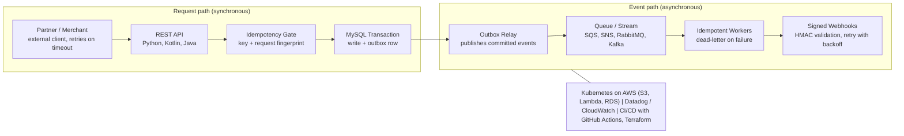

# Shaikat Majumdar

**Backend Engineering & Partner Merchant Interface Portfolio**

**Target Role:** Senior Software Engineer, Backend (Partner Merchant Interface), Affirm (Remote, US; Partner Merchant Interfaces - Integration, Decisions Foundations)

sm2774us@gmail.com | West Palm Beach, FL | [github.com/sm2774us](https://github.com/sm2774us) | [linkedin.com/in/sm2774us](https://linkedin.com/in/sm2774us)

---

## Executive Overview

This portfolio documents production-grade patterns for the work described in the Senior Software Engineer, Backend (Partner Merchant Interface) role: the APIs that partners and merchants use to integrate, distributed backend systems on AWS, MySQL, and Kubernetes, event-driven integration, and the testing, code-review, and communication practices that let a team move fast without taking production down. Each section pairs the design with a representative pattern sample, and the open-source repositories listed in Section 5 serve as architecture references.

The patterns come from 18+ years of backend engineering at Balyasny Asset Management, J.P. Morgan Asset Management (Highbridge Capital Management), and Millburn Ridgefield, where the recurring requirement was the one Affirm describes: strike the right balance of speed and quality while protecting systems from downtime.

---

## 1. Partner-Facing APIs and Integration at Scale

> **Architecture Summary.** Partner APIs are treated as contracts: validated at the edge, idempotent by design, and observable end to end, so a retried request from a merchant or partner never produces a surprise.

- **Backend APIs and Integration Interfaces:** At Balyasny, designed, developed, and launched high-throughput backend APIs and integration interfaces connecting external enterprise partners, merchant systems, and internal microservices using Python and Java.
- **Core Partner Integration APIs:** At J.P. Morgan, designed and launched core partner integration APIs and backend workflows using Java (Spring Boot) and Python, powering mission-critical transaction flows across enterprise merchant channels in fast-paced team environments.
- **Platform Lead at Scale:** At Millburn Ridgefield, architected and scaled foundational backend integration APIs and data exchange pipelines using Python, Java, C++, and SQL, handling massive daily transaction volumes with 99.999% uptime.
- **Languages and Frameworks:** Python (FastAPI, Flask, pytest), Kotlin (Ktor), Java (Spring Boot), SQL (MySQL, PostgreSQL, Snowflake).

```python
@app.post("/v1/payments", status_code=201)
def create_payment(req: PaymentRequest, idem_key: str = Header(..., alias="Idempotency-Key")):
    fp = req.fingerprint()                                   # hash of the canonical request body
    with db.transaction() as tx:                             # one MySQL transaction
        prior = tx.find_idempotent(idem_key)
        if prior and prior.fingerprint != fp:
            raise HTTPException(422, "Idempotency-Key reused with a different request")
        if prior:
            return prior.response                            # safe retry: same answer, no new side effects
        payment = tx.insert_payment(req)
        tx.insert_outbox("payment.created", payment.id)      # event is committed with the write
        tx.store_idempotent(idem_key, fp, payment.response())
    return payment.response()
```

*Representative sample of an idempotent partner-API endpoint (Python/FastAPI): replays return the original response, key misuse is rejected, and the outbox row commits atomically with the write.*

---

## 2. Event-Driven Distributed Systems on AWS, MySQL, and Kubernetes

> **Architecture Summary.** State changes are committed once and published reliably. The database transaction is the source of truth, a transactional outbox carries events to queues, and consumers are idempotent so at-least-once delivery is safe.

- **Cloud and Kubernetes:** At Balyasny, architected and deployed distributed backend components on AWS (S3, Lambda, RDS) and Kubernetes, ensuring high availability, horizontal scalability, and zero downtime during traffic spikes.
- **Event-Driven Processing Pipelines:** At J.P. Morgan, used distributed systems building blocks, including AWS (Lambda, SQS, SNS, RDS), MySQL, and Kubernetes, to build fault-tolerant, resilient event-driven processing pipelines.
- **MySQL and Data Modeling:** At Balyasny, engineered database schemas, optimized complex MySQL and SQL queries, and implemented transactional outbox patterns and idempotency guarantees for high-volume financial transactions. At Millburn Ridgefield, owned relational database design (MySQL, SQL Server) with ACID compliance across distributed software components.
- **Webhooks and Messaging:** Webhooks (HMAC validation, retry logic), Apache Kafka, RabbitMQ, Schema Registry & Evolution, and custom API gateways.

```python
def deliver(event, endpoint, secret, max_attempts=6):
    body = json.dumps(event, separators=(",", ":")).encode()
    ts = str(int(time.time()))
    sig = hmac.new(secret, ts.encode() + b"." + body, hashlib.sha256).hexdigest()
    for attempt in range(max_attempts):
        r = http.post(endpoint, data=body, timeout=5,
                      headers={"X-Signature": f"t={ts},v1={sig}", "X-Event-Id": event["id"]})
        if r.status_code < 300:
            return Delivered(attempt)
        if r.status_code < 500 and r.status_code != 429:
            return Rejected(r.status_code)                   # client error: do not retry
        time.sleep(min(2 ** attempt, 60) + random.random())  # exponential backoff with jitter
    return DeadLettered(event["id"])                         # park it for review; never drop silently
```

*Representative sample of signed webhook delivery with bounded retries (Python): receivers verify the HMAC and de-duplicate on the event id.*

---

## 3. Quality, Reliability, and Engineering Practice

> **Architecture Summary.** Speed and safety are not traded against each other. Tests, reviews, pipelines, and monitoring are what make frequent releases routine, and they are what keep a fast-moving team from causing downtime.

- **Well-Tested, Extensible Code:** At J.P. Morgan, translated complex business scenarios and operational requirements into solutions interacting with multiple software components, writing clean, easily understood, well-tested (JUnit, pytest), and extensible code.
- **Speed and Quality:** At Balyasny, struck the balance of speed and quality, meeting business and project milestones while protecting production systems from downtime through automated testing (pytest) and proactive monitoring.
- **Large Code Bases and Code Review:** Navigated large, complex codebases, debugged complex concurrency and network issues, and conducted thorough code reviews (Balyasny); debugged peers' code and provided constructive feedback across global engineering pods (J.P. Morgan).
- **CI/CD and Observability:** At Millburn Ridgefield, built automated build, test, and deployment pipelines using Docker, Kubernetes, Terraform, and GitHub Actions. Monitoring with Datadog and CloudWatch.

```python
def test_retry_with_same_key_returns_same_payment(client, db):
    body = {"amount": 12500, "currency": "USD", "merchant_id": "m_123"}
    first = client.post("/v1/payments", json=body, headers={"Idempotency-Key": "k-1"})
    again = client.post("/v1/payments", json=body, headers={"Idempotency-Key": "k-1"})
    assert first.status_code == again.status_code == 201
    assert first.json() == again.json()                      # a retry never creates a second payment
    assert db.count("payments") == 1 and db.count("outbox", topic="payment.created") == 1
    other = client.post("/v1/payments", json={**body, "amount": 99}, headers={"Idempotency-Key": "k-1"})
    assert other.status_code == 422                          # same key, different request: rejected
```

*Representative sample of a pytest contract test for the endpoint in Section 1: the behavior partners depend on is pinned down before it ships.*

---

## 4. Collaboration, Trade-Offs, and Team Community

> **Working Model.** Technical risk is made visible early, trade-offs are written down and discussed with stakeholders, and growth is treated as a team activity: reviews, feedback, and mentoring.

- **Cross-Functional Collaboration:** At Balyasny, worked collaboratively and proactively with product managers, stakeholders, and global engineering teams, creating visibility and structured dialogue regarding architectural risks, API latency trade-offs, and scalability bottlenecks.
- **Ownership and Communication:** At J.P. Morgan, demonstrated strong ownership of technical growth, proactively seeking feedback from managers, stakeholders, and peers while maintaining strong verbal and written communication across distributed teams.
- **Stakeholder Alignment and Mentorship:** At Millburn Ridgefield, partnered with executive stakeholders to create visibility into technical risks and trade-offs, mentored junior and mid-level backend engineers, and contributed to team growth, code reviews, and engineering community building.

---

## 5. Open-Source Architecture References



*Reference flow pattern for a partner-facing integration platform: the first block is the synchronous request path, the second is the asynchronous event path. Both run on the same platform and observability foundation.*

### agentic-platform: [github.com/sm2774us/agentic-platform](https://github.com/sm2774us/agentic-platform)

Production-grade multi-agent orchestration framework utilizing LLMs (LangGraph, LangChain) for automated enterprise task execution, tool calling, and hybrid RAG pipelines. Features auditable tool registries with human-in-the-loop gating, multi-cloud deployment patterns (AWS, Azure, GCP), and LLMOps observability for enterprise security environments.

*Relevance to Affirm:* Auditable registries and human-gated actions apply the same discipline as a partner API: every action traceable, risky actions controlled. Multi-cloud (AWS, Azure, GCP) and observability patterns carry over directly.

### payo-core-bank-arch: [github.com/sm2774us/payo-core-bank-arch](https://github.com/sm2774us/payo-core-bank-arch)

PAYO Core Bank — Ledger ⇄ Stablecoin Reconciliation Platform. Reference architecture for a digital bank's core transactional backbone: the system of record reconciling fiat reserves, on-chain token supply, and customer balances with bank-grade accuracy, idempotency, and auditability — including automated sanctions screening hooks and mint/burn event messaging.

*Relevance to Affirm:* Idempotency, auditability, and exact reconciliation are the properties that payment-facing partner APIs depend on.

### world-emblem-data-foundation: [github.com/sm2774us/world-emblem-data-foundation](https://github.com/sm2774us/world-emblem-data-foundation)

Governed enterprise data foundation showcase covering audit, system-of-record architecture, contract-driven idempotent pipelines (Python, SQL, Spark, Airflow, dbt), quality and reconciliation, RBAC/masking/audit, AI-ready governed access, and a machine-verified 90-day plan.

*Relevance to Affirm:* Contract-driven, idempotent pipelines in Python and SQL, with quality gates, reconciliation, and access controls.

### architect-ai-showcase: [github.com/sm2774us/architect-ai-showcase](https://github.com/sm2774us/architect-ai-showcase)

Full-stack enterprise architecture bridging secure server-side gateways, backend microservices, and cloud AI services to automate enterprise reporting and vendor workflows.

*Relevance to Affirm:* Secure gateway-to-microservice layering is the same shape as a partner integration surface in front of internal services.

### cardflow-data-platform: [github.com/sm2774us/cardflow-data-platform](https://github.com/sm2774us/cardflow-data-platform)

Event-driven card-authorization data platform. HMAC-signed webhooks feed a transactional outbox and RabbitMQ, followed by idempotent processing, data-quality gates, and an S3/Snowflake data lake. Built with Spring Boot 3, React/TypeScript, Terraform, Kubernetes/OpenShift, and Karate/Newman.

*Relevance to Affirm:* The closest match to the pattern in Sections 1 and 2: signed webhooks, transactional outbox, message queue, idempotent processing, Kubernetes, Terraform, and API-level test automation.

### equity-trade-capture: [github.com/sm2774us/equity-trade-capture](https://github.com/sm2774us/equity-trade-capture)

Real-time trade capture, streaming normalization, and P&L/risk platform for equities and autocallable structured notes, built on Java 17, Kafka, Postgres, and Angular.

*Relevance to Affirm:* High-throughput, real-time event capture and normalization on Kafka, where correctness has to hold under load.

### java-cli-ai-demo: [github.com/sm2774us/java-cli-ai-demo](https://github.com/sm2774us/java-cli-ai-demo)

Java developer CLI refined by an AI coding agent inside a human-gated workflow, with benchmarking, automated PR review, and semantic-version releases.

*Relevance to Affirm:* An engineering-practice sample: human-gated changes, automated PR review, benchmarking, and disciplined releases, matching the emphasis on code review and quality.

### Requirement Traceability

| Affirm requirement | Where it lives |
|---|---|
| Backend systems at scale in Python, Kotlin, or Java | cardflow-data-platform (Spring Boot 3); equity-trade-capture (Java 17, Kafka); world-emblem-data-foundation (Python, SQL) |
| APIs that partners and merchants integrate with | cardflow-data-platform (HMAC-signed webhooks); architect-ai-showcase (secure gateways, microservices); payo-core-bank-arch (idempotent transactional backbone) |
| Distributed systems building blocks (AWS, MySQL, Kubernetes) | cardflow-data-platform (Kubernetes/OpenShift, Terraform, S3/Snowflake, RabbitMQ); agentic-platform (AWS, Azure, GCP patterns). MySQL: see Section 2 |
| Clear, well-tested, extensible code across multiple components | cardflow-data-platform (Karate/Newman API tests); world-emblem-data-foundation (quality gates, contracts); payo-core-bank-arch |
| Large code bases, debugging, code reviews | java-cli-ai-demo (automated PR review, human-gated workflow, benchmarking, semantic-version releases) |
| Protecting systems from downtime | payo-core-bank-arch (idempotency, auditability); agentic-platform (observability); cardflow-data-platform (idempotent processing, data-quality gates) |

> **Scope note.** The repositories are open-source reference implementations that illustrate architecture patterns. They are not employer systems and contain no employer code, data, or models. The code samples in this document are representative sketches of the patterns described, not excerpts from any employer system. Role details and metrics match the accompanying resume.

---

## 6. Affirm Requirement Alignment

| Affirm requirement | Evidence | See |
|---|---|---|
| Designing, developing, and launching backend systems at scale; Python or Kotlin | Balyasny: high-throughput backend APIs and integration interfaces in Python and Java. J.P. Morgan: partner integration APIs in Java (Spring Boot) and Python. Millburn Ridgefield: 99.999% uptime at massive daily transaction volumes. | Sections 1, 5 |
| Distributed systems; AWS, MySQL, Kubernetes | AWS (S3, Lambda, SQS, SNS, RDS), MySQL, and Kubernetes in event-driven pipelines; transactional outbox and idempotency guarantees. | Section 2 |
| Turning a business scenario into a multi-component solution with clear, well-tested, extensible code | J.P. Morgan: solutions across multiple software components, tested with JUnit and pytest; TDD practice. | Sections 1, 3 |
| Navigating a large code base, debugging others' code, code reviews | Large, complex codebases; concurrency and network debugging; thorough code reviews at Balyasny and J.P. Morgan. | Sections 3, 5 |
| Ownership of growth; seeking feedback | J.P. Morgan: proactively seeking feedback from managers, stakeholders, and peers. Millburn Ridgefield: mentoring junior and mid-level engineers. | Section 4 |
| Strong verbal and written communication with a global engineering team | Communication across distributed teams and global engineering pods. | Section 4 |
| Right balance of speed and quality; protecting systems from downtime | Automated testing (pytest), proactive monitoring, and CI/CD pipelines that balance deployment velocity with protection against downtime. | Section 3 |
| Visibility and dialog on risks and trade-offs | Structured dialogue on architectural risks, API latency trade-offs, and scalability bottlenecks; alignment with executive stakeholders. | Section 4 |
| Community, growth, and development | Engineering community building, code reviews, and mentoring. | Section 4 |
| Credentials and location | M.S. Computer Engineering & Electrical Engineering (Binghamton University); B.S. Mechanical Engineering; 18+ years of practical experience. AWS Certified Data Engineer & Cloud Solutions Architect. West Palm Beach, FL (remote, US). | Resume |

**Next step.** I would welcome a walkthrough of the open-source repositories, a deeper look at the idempotency and webhook patterns above, or a working session on how they map to the Partner Merchant Interfaces - Integration team's roadmap. Contact: sm2774us@gmail.com | [github.com/sm2774us](https://github.com/sm2774us).
